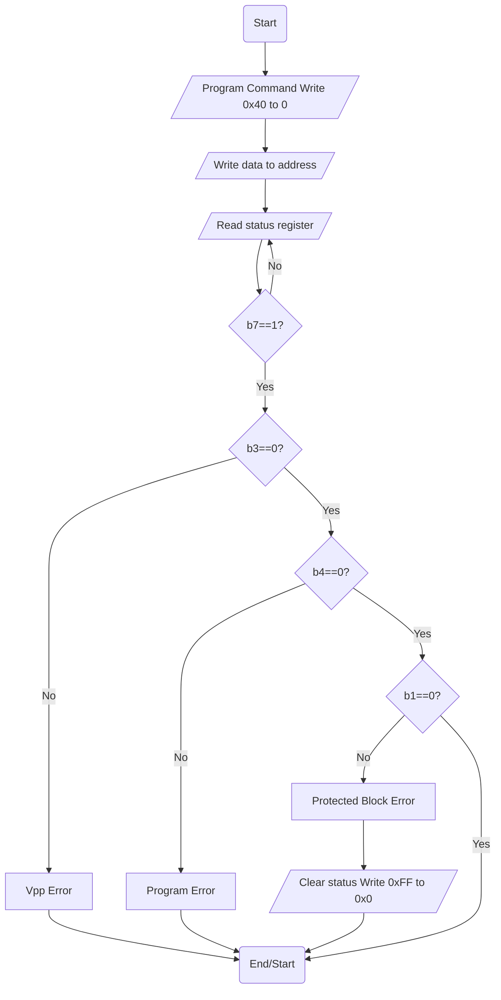

# M28W160ECx Driver

## Flash Memory Program Flow Chart

## Flash Driver Test List

- [ ] Successful Operation
- [ ] Invalid Programming Voltage
- [ ] Program error
- [ ] Attempt to program protected block
- [ ] Read back fails
- [ ] Device timeout during write operation

## References

* [CMock References](https://github.com/ThrowTheSwitch/CMock/blob/master/docs/CMock_Summary.md)

